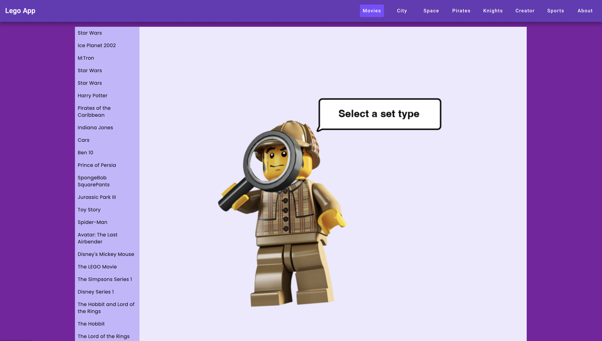
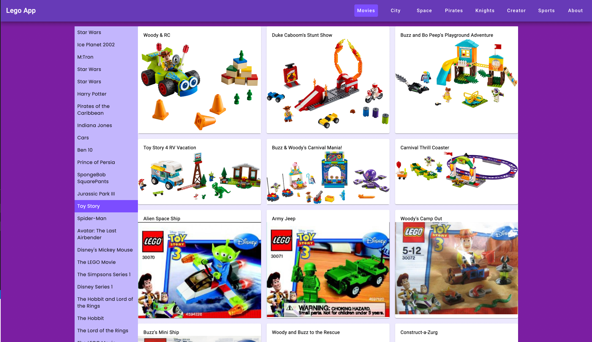

# lego-app

## Description

The lego app fetches data from the Rebrickable API (https://rebrickable.com/api/). It serves Lego sets based on themes, such as Movies, City, Space, Pirates, knights, Creator and Sports. 





---

## Tools

This Lego app is built with Angular, Angular Material and Tailwind on the Front-end, and Express and TypeScript on the Back-end.
P5.JS is used to add keyboard interactions on the home page.

---

## instructions 

1. Clone the repository on your local machine 
```
git clone git@github.com:apardor/lego.git
```
2. CD into client and server from root directory.
```
cd client
cd server
```
3. Run `npm i` on both client and server individually.
4. Create a .env file on the server folder and add credentials to the Rebrickable API (copy/paste the other parameters)
```
API_KEY="your own key"
THEME_URL="https://rebrickable.com/api/v3/lego/themes/"
SETS_URL="https://rebrickable.com/api/v3/lego/sets/"
PORT=8000
THEME_PAGE_SIZE=462
SET_PAGE_SIZE=300
```
5. On client `npm run start` and open (http://localhost:4200/)
6. On server `npm run dev` and open (http://localhost:8000/)
7. Find your favorite Lego set! :)
